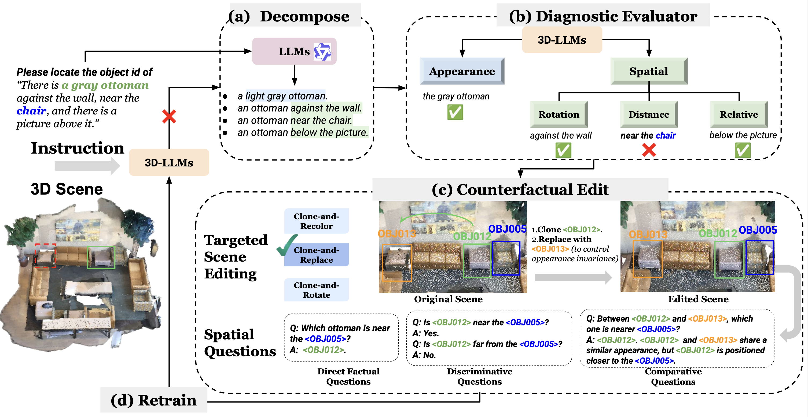

# DEER-3D
### *Error-Driven Scene Editing for 3D Grounding in Large Language Models*

**Authors:** Yue Zhang, Zun Wang, Han Lin, Jialu Li, Jianing Yang, Yonatan Bitton, Idan Szpektor, Mohit Bansal

---

## 📌 Overview

**DEER-3D** introduces an *error-driven, model-in-the-loop* scene editing framework for improving **3D visual grounding** in 3D-LLMs. Current 3D-LLMs often fail due to dataset co-occurrence biases and insufficient grounding supervision. DEER-3D resolves these limitations by generating **targeted 3D counterfactual edits** and retraining the model with more informative and bias-breaking visual signals.

<p align="center">
  
</p>

**Key idea:** Iteratively **Decompose→ Diagnose → Edit → Retrain** to construct fine-grained counterfactual scenes that strengthen spatial and appearance-based grounding.

---

## ✅ To-Do Checklist

- ✅ Release source inference code
- ⏳ Release source training code
- ⏳ Release DEER3D edit code
- ⏳ Release DEER3D edit data

## 🔧 Environment Setup

DEER-3D builds upon the [**Chat-Scene**](https://github.com/ZzZZCHS/Chat-Scene) codebase. Please first follow its setup guide:  

### 1. Create Conda Environment

```bash
conda create -n chat-scene python=3.9.17
conda activate chat-scene
conda install pytorch==2.2.1 torchvision==0.17.1 torchaudio==2.2.1 pytorch-cuda=11.8 -c pytorch -c nvidia
pip install -r requirements.txt
```

### 2. LLM Backbone Setup
DEER-3D uses **Vicuna-7B-v1.5**, consistent with Chat-Scene.  
After downloading the model, set the path in:
📄 `scripts/run.sh`

`--llama_model_path /path/to/vicuna-7b-v1.5`

### 3. Dataset & Feature Preparation

Download dataset and extracted features from [Chat-Scene preprocess](https://github.com/ZzZZCHS/Chat-Scene/tree/dev/preprocess), including 3D point cloud features, multi-view image features, object bounding boxes, and other scene-level metadata. Please update your config paths accordingly in 
`scripts/config.py`


## 🚀 Inference & Evaluation
Run evaluation with:

`bash scripts/run_eval.sh`


We provide inference checkpoints and train/eval logs.